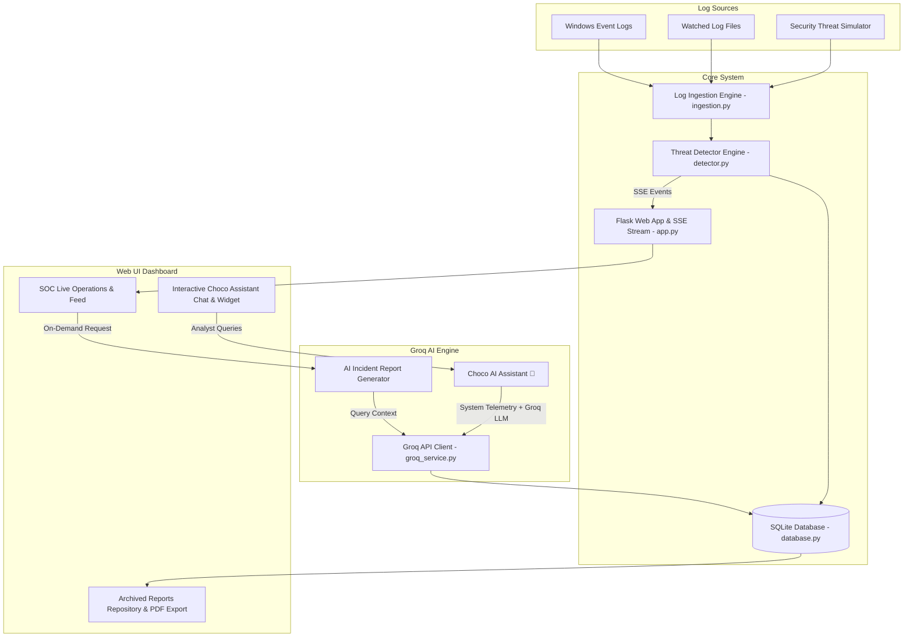

# 🛡️ SOC-AI: Real-Time Security Operations Center & AI Threat Sentinel

[](https://www.python.org/)
[](https://flask.palletsprojects.com/)
[](https://console.groq.com/)
[](https://attack.mitre.org/)
[](#license)

A modern, high-performance Python-based **Real-Time Security Operations Center (SOC) Dashboard** powered by the **Groq API** (`openai/gpt-oss-120b`, `llama-3.3-70b-versatile`). It ingests system logs live, identifies security threats, generates detailed DFIR incident analysis reports on-demand, archives reports in a dedicated section, and features **Choco 🍫**, an interactive AI Cyber Assistant.

---

## 🌟 Key Features

* **⚡ Real-Time Log Ingestion & Threat Detection**:
  * Monitors Windows Event logs (`Get-WinEvent`), custom log files (`./logs/*.log`), and an active synthetic **Security Threat Simulator**.
  * Detects SQL Injection (SQLi), Cross-Site Scripting (XSS), Brute Force attacks, Obfuscated PowerShell execution (`-EncodedCommand`), Privilege Escalation (`EventID 4728`), and Network Port Scans.
* **🤖 Groq-Powered On-Demand Incident Reports**:
  * One-click AI report generation producing comprehensive DFIR Incident Reports.
  * Mapped directly to **MITRE ATT&CK TTPs**, root cause telemetry, blast radius impact, step-by-step containment plans, and detection rule tuning.
* **📁 Archived Reports Repository & PDF Exporter**:
  * Full repository of all generated incident reports with filter by severity and title.
  * Integrated PDF export (`fpdf2`) for instant executive briefing downloads.
* **🍫 Choco AI Cyber Mascot Assistant**:
  * Context-aware interactive assistant floating widget and full chat workspace.
  * Connected directly to live system log telemetry and threat metrics.
  * Formulates incident response scripts (PowerShell, Bash, Python, Firewall rules) on demand.
* **📊 Modern Dark SOC Analytics Dashboard**:
  * Real-time Server-Sent Events (SSE) updates without page refreshes.
  * Donut charts for threat severity distribution & top threat category metrics.
  * Single-click attack simulation triggers (`SQLi`, `BruteForce`, `PowerShell`).

---

## 🏗️ System Architecture



---

## 📂 Project Structure

```text
SOC analysis with AI/
├── app.py                 # Flask Server, REST APIs, SSE Streaming & PDF Exporter
├── database.py            # SQLite database schema (logs, events, reports, settings)
├── detector.py            # Heuristic & Regex Threat Detection Engine (MITRE TTPs)
├── ingestion.py           # Multi-Source Log Ingestor & Attack Simulator
├── groq_service.py        # Groq API Integration (Reports & Choco Assistant Persona)
├── run.bat                # 1-Click Windows Launcher (Starts App & Opens Browser)
├── requirements.txt       # Python project dependencies
├── .env.example           # Environment template for GROQ_API_KEY
├── .gitignore             # Shields secret keys (.env) and local database files (.db)
├── static/
│   └── choco.jpg          # Choco AI Mascot Avatar Image
└── templates/
    └── index.html         # Modern Dark-Themed SOC Dashboard SPA UI
```

---

## 🚀 Quick Start Guide

### Prerequisites
* **Python 3.10+** installed on your system.
* A free **Groq API Key** from [console.groq.com/keys](https://console.groq.com/keys).

### Installation & Setup

1. **Clone the Repository**:
   ```bash
   git clone https://github.com/ritu34/Soc-Analysis.git
   cd Soc-Analysis
   ```

2. **Install Dependencies**:
   ```bash
   pip install -r requirements.txt
   ```

3. **Configure Environment Variables**:
   Copy `.env.example` to `.env` and enter your Groq API Key:
   ```env
   GROQ_API_KEY=gsk_your_actual_groq_api_key_here
   GROQ_MODEL=openai/gpt-oss-120b
   ```
   *(Note: You can also configure your API key directly inside the Dashboard Settings modal UI!)*

4. **Launch the Dashboard**:
   * **Windows 1-Click Launcher**: Double-click `run.bat`
   * **Terminal Command**:
     ```bash
     python app.py
     ```

5. **Open Browser**:
   Navigate to **`http://127.0.0.1:5000`**

---

## ⚙️ Configuration & Settings

* **Threat Attack Simulator**: Enabled by default for instant live demonstration. You can toggle it OFF anytime via the **Settings ⚙️** modal in the dashboard header to monitor real local system logs exclusively.
* **Supported LLM Models**:
  * `openai/gpt-oss-120b` (Default)
  * `llama-3.3-70b-versatile`
  * `groq/compound`
  * `qwen/qwen3.8-27b`

---

## 🛡️ Security & Privacy Notice

* Secrets such as `GROQ_API_KEY` are stored locally in `.env` and are strictly excluded from git tracking via `.gitignore`.
* All log analysis telemetry sent to Groq is processed over secure TLS connections.

---

## 📜 License

This project is open-source under the [MIT License](LICENSE).
